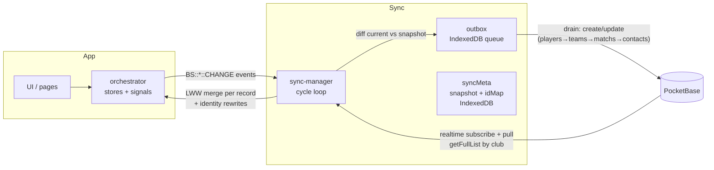

# PocketBase POC Analysis (ballerStats)

> Status: **historical analysis**. Phase 3 has reframed the target: Nostromo is a generic core
> (auth, file storage, document access control) with zero app knowledge. The final decisions are
> recorded in `docs/decisions.md`. The drift list below is retained as historical analysis of the
> POC, not as the Nostromo design.
>
> Sources:
> - `ballerStats` branch `pocketbase` (POC, 212 files changed, +10 737 / −3 391 vs `develop`)
> - `ballerStats` branch `develop` (truth of the current offline-first implementation)
> - `infra/pocketbase/` on the POC branch (migrations, rules, hooks, scripts)

## 1. Context

### 1.1 The problem Nostromo solves

ballerStats is offline-first: all domain data (players, teams, matchs, contacts) lives in
`localStorage` via `src/libs/store/store.ts`, photos in IndexedDB (`photo-store`), and sharing is a
manual export/import flow (`orchestrator.exportDB()` / `importDB()`, `.bstat` files). This worked for
a handful of users but cannot scale to real multi-user usage: no accounts, no live sharing, no
conflict handling, heavy manual backups.

Nostromo is the shared PocketBase backend that several offline-first apps (starting with
ballerStats) will use for accounts, storage and sync.

### 1.2 The ballerStats domain model (develop, source of truth)

| Entity | Local id | Notable fields |
|---|---|---|
| `PlayerRawData` | numeric string from `getUniqId()` (e.g. `"4231978422"`) | `firstName`, `lastName`, `nicName` (sic), `jerseyNumber` (string, `"00"` vs `"0"` matters), `licenseNumber`, `birthDay` (ms epoch), `email`, `phone`, `hasPhoto`, `clubId` |
| `TeamRawData` | numeric string | `name`, `playerIds: string[]`, `clubId` |
| `MatchRawData` | numeric string | `opponent`, `type` (`home`/`outside`), `date` (string), `championship`, `status` (`unlocked`/`locked`), `playersInTheFive: string[]`, `stats: {name, type, value, playerId, timestamp}[]`, `teamId` |
| `ContactRawData` | numeric string | `playerId`, `relationship`, names, `phone`, `email`, `address` |
| `ClubRawData` | numeric string | `name`, `licenseNumber` — one default club is auto-created (`club-migration.ts`) |

Local persistence: one JSON envelope `{ data, lastRecord }` per entity in `localStorage`.
The orchestrator owns load/save, import/export (zip via `fflate`), and photo lifecycle.

## 2. What the POC built

### 2.1 Server side (`infra/pocketbase/`, PocketBase v0.40.0)

**Collections** (`pb_migrations/002_collections.js`):

```
clubs ──< club_members >── users (auth)
  │              (role: owner|admin|staff)
  ├──< teams ──< team_members >── users (access: read|write)
  │        │
  │        └──< team_players >── players
  ├──< players ──< contacts
  └──< matchs (team relation, stats JSON, playersInTheFive JSON)
```

- Every domain record carries `club` (relation), `updatedAt: number`, `deletedAt: number`
  (tombstones; 0 means live — see §2.3).
- `matchs` adds `scorer` (relation) + `scorerLockUntil` (date) for the scoring lease.
- `players` adds a `photo` file field (webp/jpeg/png, 2 MB) and `hasPhoto` bool.
- `teams` keeps `playerIds` as JSON **and** the `team_players` junction exists (dual model — see
  drift D2).
- Uniqueness enforced by UNIQUE indexes: `(club, user)`, `(team, user)`, `(team, player)`.

**API rules** (`003_rules.js`): owner/admin of a club see and manage everything in it; `staff` only
see teams they have a `team_members` row on, and the players/contacts/matchs reachable through those
teams (`X_via_field` back-relations with `?=` any-of operators). `users` is locked down: no public
signup (`createRule = null`), self view/update only; provisioning happens via the invite hook or the
bootstrap script.

**Hooks** (`pb_hooks/*.pb.js`):

| Hook | Route/Trigger | What it does |
|---|---|---|
| `invite.pb.js` | `POST /api/baller/invite` | Owner/admin creates a user (random 12-char password returned **once**, no SMTP), `club_members` row, optional `team_members` row. Idempotent on email. |
| | `POST /api/baller/users/enrich` | `{ids} → {users:[{id,name,email}]}` so the SPA can show member names without opening `users`. |
| `matchs_lock.pb.js` | `POST /api/baller/matchs/{id}/acquire` (+ `/release`) | Scoring lease: 45 s TTL, heartbeat renewed by the client every 15 s; 409 with holder info if taken; `force` for owner/admin. |
| | `onRecordUpdateRequest('matchs')` | Rejects (403) changes to `stats`/`playersInTheFive` unless caller is the active scorer, club owner/admin, or superuser. Other fields flow through normal rules. |
| `players_attach.pb.js` | `onRecordCreateRequest('players'/'contacts')` | Staff creators must attach a new player to a writable team (`teamIds` in body); the hook creates `team_players`. Contacts require write access on a team containing the player. |

**Scripts**: `download.sh` (pinned v0.40.0), `serve.sh` (`--automigrate=0`, CORS for the Vite dev
server on port 3000), `bootstrap.sh` (idempotent dev-only superuser + demo club + owner).

### 2.2 Client side

**Auth** (`src/libs/auth/`): email/password via the PB SDK; `currentUser` / `currentClub` /
`currentRole` as MadSignals; resolves "the" membership from the first `club_members` row
(v1 assumption: **one club per user**). `isAuthEnabled` is false when `VITE_POCKETBASE_URL` is
empty, which keeps the app fully usable offline/anonymously (graceful degradation).

**Sync engine** (`src/libs/sync/`, ~1 900 lines + tests):



Key mechanisms:

- **Outbox**: one pending item per record (`collection:id`), rebuilt payload at push time from the
  live record so FKs always use the freshest id map. Soft failures retry (drop after 5 attempts);
  network/401/5xx abort the drain.
- **Push order**: `players → teams → matchs → contacts` (dependencies first). A match whose team has
  no resolvable PB id stays queued.
- **Legacy ids**: local numeric ids are not valid PB ids (`/^[a-z0-9]{15}$/`). On create, the
  server id is written back and the manager **re-keys the record and every FK referencing it**
  (`rewriteIdentities` + photo blob move).
- **LWW (last-write-wins)**: per record, higher `updatedAt` wins; ties keep the local copy. Every
  mutation in the app bumps `updatedAt` (per-record epoch ms).
- **First sync** (first login of a device): pull everything; if both sides are non-empty, a modal
  asks *push-local or pull-remote*; pull-remote triggers an automatic `.bstat` export backup first.
- **Realtime**: PB subscriptions trigger debounced pulls (2 s); local changes trigger debounced
  drains (3 s); error retries every 45 s.
- **Photos**: dual storage. Blobs stay in IndexedDB; `players.photo` is a PB file. Upload when the
  local blob is new vs snapshot, download when remote `hasPhoto` and no local blob.
- **Lease client** (`src/libs/lease/`): acquire/heartbeat/release + 409 holder extraction; the match
  screen shows a banner when someone else is scoring.
- **Team sharing UI** (`src/libs/team-sharing/` + `users.tsx`): owner/admin invite staff, manage
  per-team read/write shares.

**App-model changes the POC imposed on ballerStats** (the "inverse adaptation" the project owner
wants to challenge):

- Added `updatedAt` / `deletedAt` to all four raw types; every mutation must bump `updatedAt`
  (orchestrator was rewritten for this).
- **Deleted `src/libs/club/` and `src/libs/stores/`** — the local Club entity and its migration are
  replaced by server `clubs` + `currentClub` from auth. The local multi-club capability of develop
  is gone in the POC.
- Deleted all barrel `index.ts` files and switched to direct module imports (unrelated to PocketBase
  but riding along).
- `clubId` on players/teams is now resolved from the session, not stored per record locally.
- New pages/UI: `login.tsx`, lease banner on match screen, staff/invites/sharing management in
  `users.tsx`, sync status in app bar.

## 3. Drifts to challenge (phase 3 agenda)

Each drift: what the POC did → why it deserves challenge → options for Nostromo.

### D1 — Schema was bent to fit the app's legacy shapes

- **POC**: all four entities keep app-level `updatedAt`/`deletedAt` as plain number fields, with the
  `0 means live` convention (`deletedAtForPayload`), because legacy local data lacks them.
- **Challenge**: PB has a native `updated` auto datetime per record; tombstones could be real record
  deletions + `deleted` datetime field, or a separate sync convention. The `0`/epoch-ms number
  convention exists only to serve the app's legacy merge logic.
- **Options**: (a) keep as-is (max app compatibility), (b) use PB `updated` and derive LWW client
  side, (c) tombstone via deleted-flag but ISO datetimes. Decision impacts every future app.

### D2 — Dual player-team membership model (`teams.playerIds` JSON + `team_players` junction)

- **POC**: `playerIds` JSON on `teams` is pushed and used by the client, while `team_players` is the
  ACL source of truth and is re-synced after each team push (`syncTeamPlayers`).
- **Challenge**: two sources of truth that can diverge (they already need reconciliation logic).
  For a generic backend, the junction alone should suffice; the client can derive `playerIds` from
  it on pull.
- **Options**: (a) junction only (server-side truth, client derives), (b) keep dual (app
  compatibility, honest cost), (c) JSON only with rules rewritten without back-relations (weaker
  ACL expressiveness).

### D3 — Club concept was ripped out of the app

> Chronology correction: the POC **predates** the club feature. The app's `develop` branch later
> added a local club model, and `develop` is the source of truth for the club data structure.

- **POC**: `src/libs/club/` + `src/libs/stores/` deleted; club comes from auth; one club per user
  (v1 assumption hardcoded in `auth.resolveMembership` and the invite hook).
- **Challenge**: this is the biggest "app adapted to backend" move. develop supports a local club
  entity (name, licenseNumber) usable without any account. Multi-club users are unmodelled.
- **Options**: (a) accept single-club-per-user v1 and model multi-club later (`club_members` already
  allows it schema-wise), (b) design multi-club now (club switcher, membership resolution list),
  (c) keep an app-local club that binds to a server club on first sync (keeps offline creation).

### D4 — Custom routes namespaced `/api/baller/*`

- **POC**: all custom endpoints live under `/api/baller/...` (invite, enrich, acquire, release).
- **Challenge**: for a **generic multi-app** backend, routes should be app-namespaced
  (`/api/ballerstats/...`) and common services (e.g. invites) possibly genericized
  (`/api/nostromo/...`) with per-app hooks only where semantics are app-specific.
- **Options**: (a) rename to `/api/ballerstats/*` now (cheap, keeps generic core clean), (b) split:
  generic invite/enrich under `/api/nostromo/*`, lease stays app-specific, (c) leave as-is for the
  first integration.

### D5 — No SMTP: invite passwords returned once in the response

- **POC**: invite response contains the generated password; the admin copies it to the coach.
- **Challenge**: acceptable for a small club tool, not for a "multi-user ambition". PB has built-in
  password-reset / OTP emails when SMTP is configured.
- **Options**: (a) keep for v1 + plan SMTP before production, (b) implement email invite now
  (needs SMTP infra + templates), (c) invite-link flow (token URL, no password transport).

### D6 — `nicName` typo and loose text fields propagated into the server schema

- **POC**: server fields mirror app naming (`nicName`), `birthDay` is text (app sends
  `String(epoch)`), `date` on matchs is free text, `type`/`status` are text max 50 (only `status`
  became a select).
- **Challenge**: the server schema is the durable contract; a generic backend should use clean
  names (`nickName`), proper types (`date`/`number`), and selects where values are closed sets.
  Every future app inherits these fields.
- **Options**: (a) clean up now with a mapping layer in the app (recommended), (b) keep mirror for
  zero-app-cost.

### D7 — Photos: dual storage (PB file + app IndexedDB blob)

- **POC**: `players.photo` file on the server, blobs stay in IndexedDB locally, `hasPhoto` flag
  drives up/download decisions.
- **Challenge**: sensible for offline-first, but the decision table (snapshot-based) is subtle and
  app-specific. A generic backend should expose this as a documented pattern (or a tiny shared
  client helper) rather than have each app reinvent it.
- **Options**: (a) document as the recommended pattern + extract helper later, (b) server-side
  thumbnail/variant service later (PB handles on-the-fly resize for images already).

### D8 — Where the sync engine lives

- **POC**: the whole engine (~2 500 lines with tests) lives inside ballerStats (`src/libs/sync/`).
- **Challenge**: every Nostromo app will need pull/push/outbox/idMap/LWW/photos. Duplicating per app
  means N many engines to keep in sync with server rules. But a shared engine constrains apps to the
  same storage/model conventions.
- **Options**: (a) keep per-app for now, extract when app #2 arrives (rule of three), (b) extract a
  `nostromo-client` TS package now (in Nostromo or a sibling repo), (c) monorepo Nostromo hosting
  both backend infra and shared client lib.

### D9 — Versioning and deployment

- **POC**: PocketBase pinned `0.40.0` (server, Sept 2026 latest stable is `0.40.3`), SDK
  `^0.28.0`; everything dev-local; no prod story (CORS hardcoded to localhost, no TLS/reverse proxy,
  no backup of `pb_data`).
- **Challenge**: Nostromo should pin the latest stable, define the prod deployment target (existing
  `marius.click` host?), CORS strategy per environment, and a `pb_data` backup routine.
- **Options**: open — needs the user's hosting constraints.

### D10 — Security model gaps (assumed v1 trade-offs)

- POC-acknowledged holes: `clubs.createRule` allows unlimited club creation; users can create a club
  without joining flow; `users.viewRule` is self-only (names resolved via enrich hook); lease is
  advisory (no base-level lock); no rate limiting beyond PB defaults; superuser bypasses everything.
- **Challenge**: fine for a POC; must be revisited before opening to real users. Also: the enrich
  route returns emails to any manager (PII exposure inside a club scope — acceptable?).

## 4. What the POC got right (keep as-is in Nostromo)

- Collection topology (club/club_members/teams/team_members/team_players) maps cleanly onto the
  real-world permissions ("staff of team X edits team X").
- API-rules-first design with UNIQUE indexes, enforced server-side; hooks only for what rules
  cannot express (provisioning, attach, lease).
- Outbox + snapshot diffing + id-map: a solid offline-first push/pull core with legacy-id
  re-keying solved honestly.
- Explicit first-sync UX with automatic local backup before destructive adoption.
- Realtime-driven pulls + debouncing; lease TTL/heartbeat split (45 s/15 s).
- Dev-local, idempotent bootstrap; migrations-as-code; `--automigrate=0`.
- POC kept the app 100 % usable with auth disabled (`isAuthEnabled`).

## 5. Open questions (to resolve during phase 3)

1. D1: keep `updatedAt`/`deletedAt` number convention or move to PB-native datetimes?
2. D2: junction-only vs dual model for player-team membership?
3. D3: single-club v1 accepted? Multi-club roadmap?
4. D4: route namespace (`/api/ballerstats/*`? generic `/api/nostromo/*` for invites/enrich?)
5. D5: invite flow v1 (password-once vs invite links vs SMTP now)?
6. D6: schema cleanup (`nickName`, typed `birthDay`, selects) with app-side mapping?
7. D8: sync engine per-app now / shared package later / shared package now?
8. D9: production target and domain, CORS, TLS, backups?
9. Should Nostromo ship a minimal generic collections set (users, clubs, memberships) with
   app-specific collections namespaced (e.g. `bs_players`) or keep the POC's flat names?
10. Realtime: is PB subscriptions the only transport (no push notifications, acceptable for v1)?
